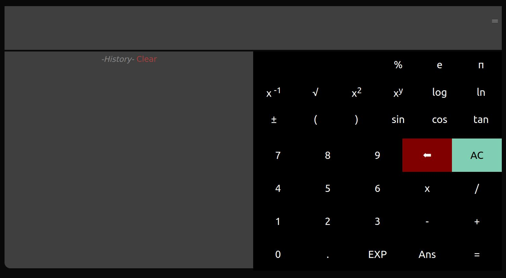
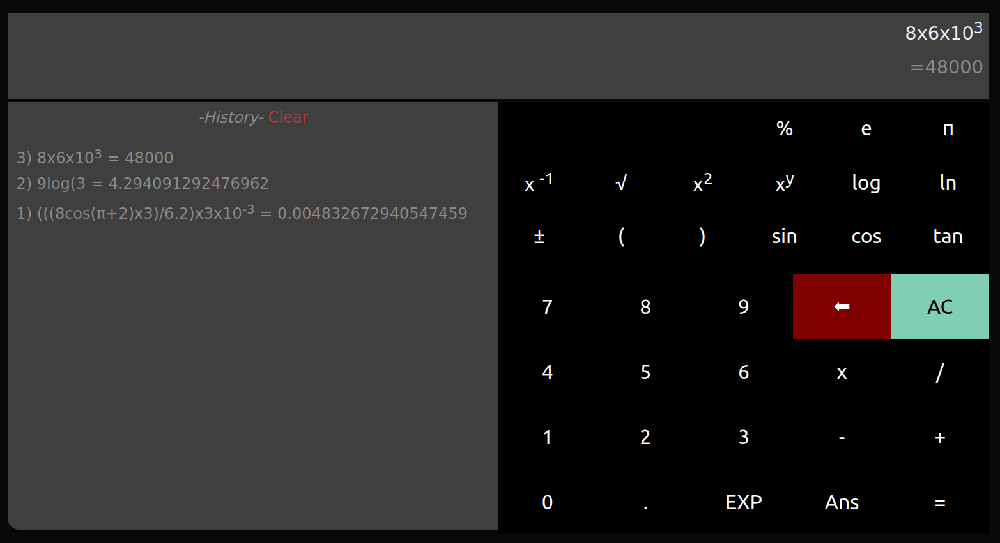
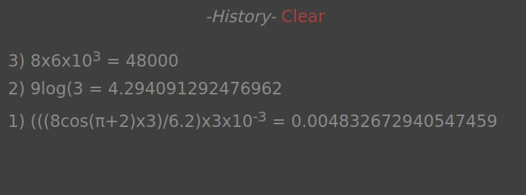
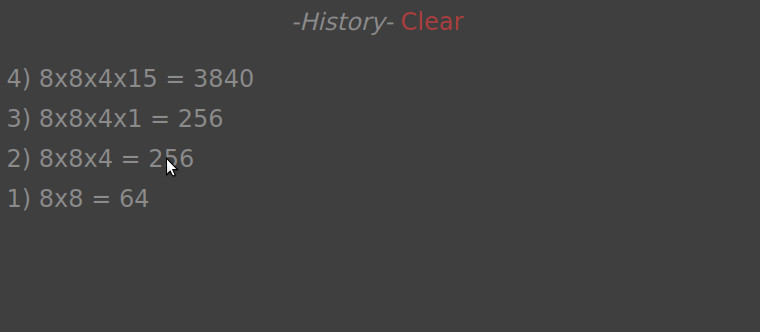
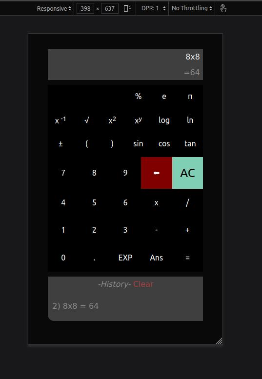

# Scientific Calculator

Live site: [Scientific Calculator web app](https://javierdebug.github.io/Scientific-calculator/)

**About this project:** Project developed using HTML, CSS and Vanilla JavaScript, it performs different Math functions one would use to resolve advanced Math calculations. I had to assure the quality of the calculator app, no failures should be present. The tricky part is that some Math calculations can be expressed very differently, some people may use many parentheses (or omit them), power, change sign (positive to negative or vice versa), so I must check many test cases to assure the calculator works as intended.

This is still a work in progress, I'm creating other functions and I can include more in the future, as a 2nd mode (many scientific calculators include it) or adding more rows at the top.

This is a responsive webapp, using Grid and Flexbox for layout and 'clamp()' functionality for font sizes, it's able to adapt to different screen sizes.

**General view of the web app.**

**Some scientific Calculations.** Note the app is able to perfom the calculation even is written incorrectly. 

**Other example of a malformed expression.** It can fix some of the errors.

**It will show an error for unfixable malformed math expressions**

**History section of the Calculator**

### **Recover previous results and expressions**
One of the main features of this Scientific Calculator web app is the possibility to recover previous generated expressions and results, and work with them to generate other math formula.

### Adaptable for small screen sizes. 
This is a responsive (mobile friendly) app!

